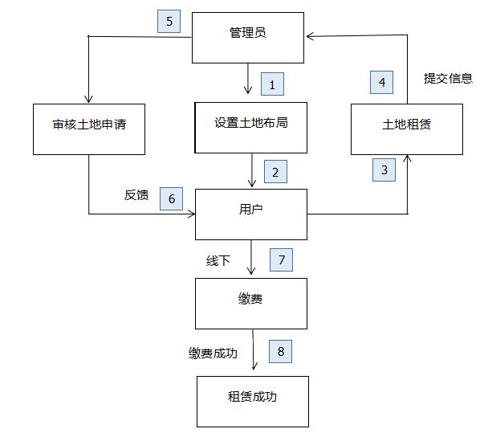
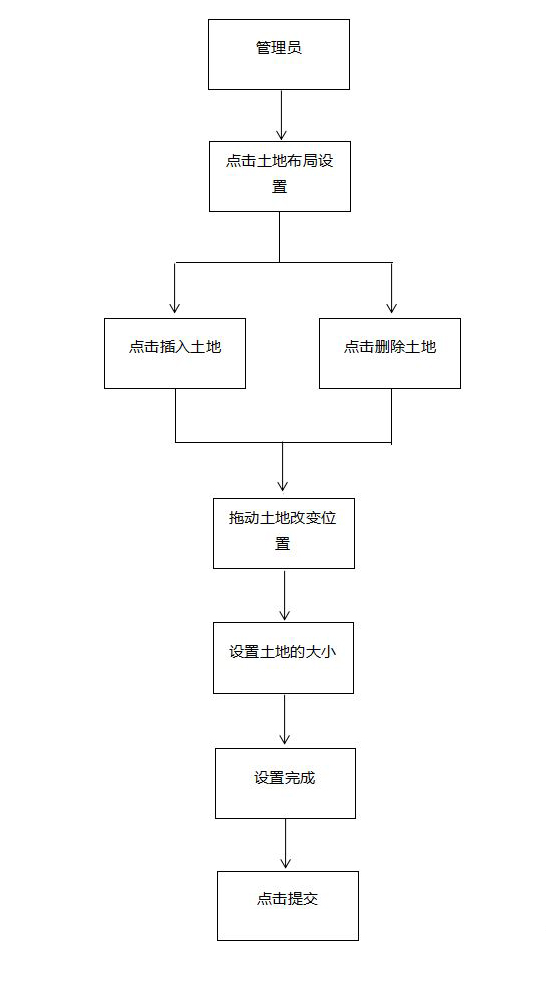
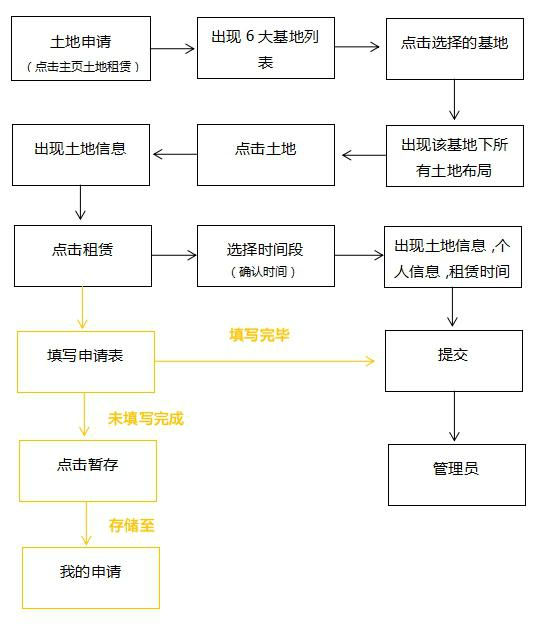
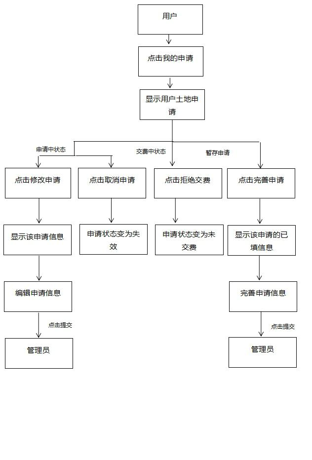
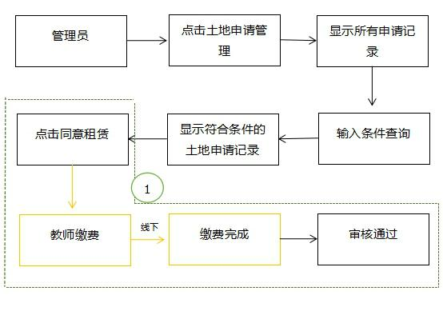
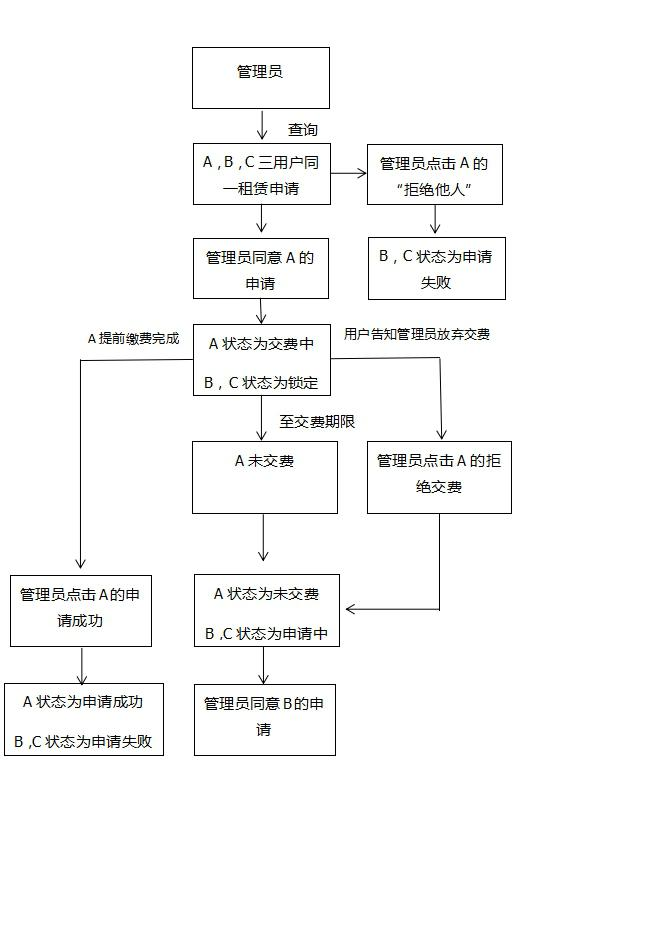
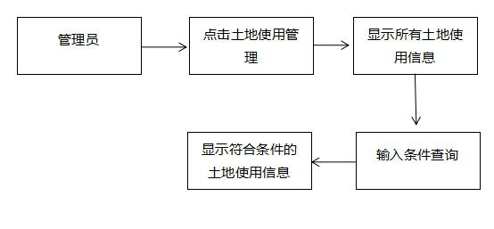
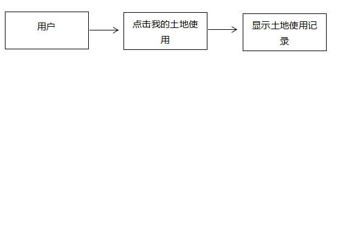

# 土地租赁模块设计文档
### 一．土地租赁概述
土地租赁模块主要用于教师对校内6大基地中的土地进行租赁。我们负责将繁绕复杂的工序简单化，合理化，多样化。首先，用户可以通过两种方式查看相应土地的信息，如果是足不出户的用户可以选择登录网站来了解每一块土地的信息，如果是亲临现场考察的用户可以扫描土地上所标识的二维码进行查看。对于最为重要的土地租赁流程，用户按照网站提示进行租赁申请，管理员进行审核，我们将管理员的管理与教师用户的申请进行合理的划分，使双方可以进行有效的，紧密的，实时的交互。 
### 二.流程图
#### (1).总业务流程图

#### (2). 分业务流程图
#### 1． 土地布局流程图

#### 2． 土地租赁流程图  
   
#### 3． 用户申请交互流程图 
      
#### 4． 土地申请审核图  
    

下图对应上图中的标记1处，为土地申请记录各种状态转换的逻辑。为了流程的简单易理解，在此处我将三用户提交的租赁申请设定为A，B，C，申请的六种状态分别为：1.申请中	2.交费中	3.锁定	4.未交费	5.申请失败	6.申请成功

#### 5.用户手机操作流程图  

#### 6． 土地使用信息流程图  

### 三． 表的创建
#### 1． 基地信息表baseInfo 

| Attribute name  | Key Type | Null/Unique | Default | Data Type | Sample Data |
| --------------- | -------- | ----------- | ------- | --------- | ----------- |
| bid(基地编号)   | P        | not null    |         | int       | 自增           |
| bname(基地名称) |          | not null    |         | varchar   | "长安基地"  |
| btype(基地类型) |          | not null    |         | int       |   1或2或3          |
注：基地信息表中的btype字段一共可取三个值：1.代表土地   2.代表校内     3.代表校外     

#### 2.土地信息表landInfo 

| Attribute name                | Key Type | Null/Unique | Default | Data Type | Sample Data    |
| ----------------------------- | -------- | ----------- | ------- | --------- | -------------- |
| Lid（土地编号）              | P        | not null    |         | int       | 自增           |
| lname (土地名称)             |          | not null    |         | varchar   | "耕园果蔬基地" |
| College (所属学院)           |          | null        |         | varchar   | "生科院"       |
| Major_oriented  (面向专业)   |          | null        |         | varchar   | "动物科学"     |
| plantingContent （推荐种植内容） |          | null        |         | varchar   | "玉米"         |
| landArea (土地面积/亩)       |          | not null    |         | int       | 8              |
| Afford(可承担人数/人)        |          | null        |         | int       | 70             |
| buildingArea(建筑面积)     |          | null        |         | int       | 70             |
| bid(基地编号)              |   F       | not null    |         | int       |   参照基地信息表中的主键              |
      
      

#### 3． 土地布局表landLayout 

| Attribute name        | Key Type | Null/Unique | Default | Data Type | Sample Data          |
| --------------------- | -------- | ----------- | ------- | --------- | -------------------- |
| id   (序号)           | P        | not null    |         | int       | 1                    |
| x_axis     (x坐标)    |          | not null    |         | int       | 100                  |
| y_axis     (y坐标)    |          | not null    |         | int       | 100                  |
| width    (宽度/px)    |          | not null    |         | int       | 20                   |
| height    （高度/px） |          | not null    |         | int       | 40                   |
| lid    (土地编号)     |   F       | not null    |         | int       | 参照土地信息表的主键 |
| bid    (基地编号)     |  F        | not null    |         | int       | 参照基地信息表的主键 |
      
      
#### 4． 土地申请表landApply 

| Attribute name            | Key Type | Null/Unique | Default | Data Type | Sample Data        |
| ------------------------- | -------- | ----------- | ------- | --------- | ------------------ |
| la_id（序号）             | P        | not null    |         | int       | 自增               |
| Lid（土地编号）           | F         | not null    |         | int       |  参照土地信息表中的主键                  |
| startTime（起始日期）   |          | not null    |       | varchar       |  "2016-11-20"                |
| endTime（结束日期）   |          | not null    |       |varchar      |  "2017-11-20"                |
| planting（种植内容）   |          |  null    |      | varchar    |"大豆"                 |
| applicantId（申请人）     | F        | not null    |         | int       | 参照教师表中的主键 |
| Status（申请状态）        |          | not null    |         | int       | 1或2或3...或7                  |
| startTime（开始交费时间） |          | null        |         | varchar   | "2016-11-20"       |
注意：土地申请表中的status字段一共有七种值供选择：1.交费中  2.申请中 3.未交费   4.锁定   5.竞争失败   6.申请成功     
	7.失效（用户自行取消申请）  8.管理员拒绝  

  
#### 5． 土地使用表

| Attribute name          | Key Type | Null/Unique | Default | Data Type | Sample Data        |
| ----------------------- | -------- | ----------- | ------- | --------- | ------------------ |
| lr_id（序号）           | P        | not null    |         | int       | 自增               |
| Lid（土地编号）         |          | not null    |         | int       |  2                  |
| startTime（起始日期）   |          | not null    |       | date      |       "2016-11-20"           |
| endTime（结束日期）   |          | not null    |       | date      |      "2017-11-20"                 |
| planting（种植内容）   |          |  null    |      | varchar    |  "大豆"               |
| userId（使用人）        |          | not null    |         | int       | 参照教师表中的主键 |
| rentMoney （经费）      |          | not null    |         | int       | 1000               |
| chargeDate(收费日期)    |          | not null    |         | varchar   |  "2016-11-20"                 |

#### 6． 人员信息表userInfo

| Attribute name          | Key Type | Null/Unique | Default | Data Type | Sample Data        |
| ----------------------- | -------- | ----------- | ------- | --------- | ------------------ |
| id（序号）           | P        | not null    |         | int       | 自增               |
|  name（姓名）         |          | not null    |         | varchar        |   "张三"               |
|sex(性别)   |          | not null    |       | varchar   |        "男"           |
|  ID_number(身份证号)    |          | not null    |       | varchar      |    "4303811989030150××"                  |
| telephone(联系电话)   |          |   null     |      | varchar    |  "187××××××××"               |
| facultytype（人员类别）        |          | not null    |         | varchar       |  "在职人员"      |
|  dept（部门）     |          | null    |         |varchar       | "教务处"               |
| college(所属学院)     |          | null    |         | varchar   |  "信科院"                 |
| userRight(用户权限)          |         | not null    |         | int       | 参照用户权限表的主键          |
|  formerUnit(原工作单位)            |          | not null    |         | varchar        |   "湖南农业大学"              |
| hukou(户口性质)  |          |  null    |       | varchar   |         "农业户口"             |
|  arriveTime（来校工作时间）   |          |  null    |       | date     |    1989-01-12                |
| Worktime(参加工作时间)      |          |   null     |      | date   |  1989-01-12           |
| contactForm(签订合同形式)        |          |  null    |         |  varchar       |  "劳务协议"     |
|  workingForm(用工形式)      |          | null    |         |varchar       | "计划内"                |
|startContactTime（合同开始时间）     |          | null    |         | date   | 2011-09-01               |
| endContactTime（合同开始时间）     |          | null    |         | date   |  2011-09-01                 |

#### 7． admin(用户权限表)

| Attribute name          | Key Type | Null/Unique | Default | Data Type | Sample Data        |
| ----------------------- | -------- | ----------- | ------- | --------- | ------------------ |
| adminid(序号)           | P        | not null    |         | int       | 自增               |
|admintype（管理类型）         |          | not null    |         | varchar     |  "教师"                |
| adminValue（管理权限值）  |          |  null    |       | int    |      32           |

 
    

### 四． 代码设计

本系统采用SSH框架实现，一共涉及四层分布：      

	action层:控制层，主要实现页面的请求与响应,控制各个页面之间的跳转 ;      

	service层：业务逻辑层，主要实现代码内部逻辑功能；    

	dao层：数据库连接层，主要与数据库进行直接交互连接；      

	po层：实体层，每一个实体类对应数据库中的一张表。     

下述为针对该模块所设计的action层，service层及对应dao层的相关接口：      

Action层:    

	1.申请控制：LandApplyController    
 
	2.审核控制：CheckController    
    
	3.交费控制:  PayForController    
 
	4.土地信息管理控制：LandInfoController    
   
	5.土地租赁管理控制:LandRentController  
  
Service层：   

	1.申请逻辑：LandApplyService      
	
	2.审核逻辑：CheckService      
	
	3.交费逻辑:  PayForService      
	
	4.土地信息管理逻辑：LandInfoService       
	
	5.土地租赁管理逻辑:LandRentService      
	
Dao层：      

	1.基地信息数据交互：BaseInfoDao     
	
	2.土地信息数据交互：LandInfoDao     
	
	 3.土地布局数据交互：LandLayoutDao    
	 
	 4.土地申请数据交互：LandApplyDao     
	 
	5.土地使用数据交互：LandRentDao     
	

Action层:

//申请模块的控制层     

@Controller("landApplyController")    

public class LandApplyController {

	//基地查询
	@RequestMapping("/baseInfo.do")
	public String selectBase(ModelMap map)
	{
		return null;		
	}
	
	//土地布局查询
	@RequestMapping("/layout.do")
	public String selectLandLayout(HttpServletRequest request,ModelMap map)
	{
		return null;		
	}
	
	//土地信息查询
	@RequestMapping("/landInfo.do")
	public String selectLandInfo(HttpServletRequest request,ModelMap map)
	{
		return null;		
	}
	
	//月份空闲查询
	@RequestMapping("/timeSpare.do")
	public String timeSpare(HttpServletRequest request,ModelMap map)
	{
		return null;		
	}
	
	
	//获取申请信息(点击租赁按钮，获取教师+土地+个人信息)
	@RequestMapping("/AllApplyInfo.do")
	public String getAllApplyInfo(HttpServletRequest request,ModelMap map)
	{
		return null;		
	}
	
	//提交申请
	@RequestMapping("/submitApply.do")
	public String submitApply(HttpServletRequest request,ModelMap map)
	{
		return null;		
	}
	
	//修改申请
	@RequestMapping("/updateApply.do")
	public String updateApply(HttpServletRequest request,ModelMap map)
	{
		return null;		
	}
	
	//查看申请
	@RequestMapping("/checkApply.do")
	public String checkApply(ModelMap map)
	{
		return null;		
	}
	
	//取消申请
	@RequestMapping("/cancelApply.do")
	public String cancelApply(HttpServletRequest request,ModelMap map)
	{
		return null;		
	}
}

//审核模块的controller类     

public class CheckController {

	//查询所有申请记录
	@RequestMapping("/checkApplyRecord.do")
	public String checkApply(ModelMap map)
	{
		return null;		
	}	
	
	//同意申请
	@RequestMapping("/agreeApply.do")
	public String agreeApply(HttpServletRequest request,ModelMap map)
	{
		return null;		
	}
	
	//拒绝他人申请
	@RequestMapping("/refuseApply.do")
	public String refuseApply(HttpServletRequest request,ModelMap map)
	{
		return null;		
	}
	
	
	
}

//交费模块的controller类     

public class PayForController {

	//拒绝交费
	@RequestMapping("/refusePay.do")
	public String refusePay(ModelMap map)
	{
		return null;		
	}
	
	//交费成功
	@RequestMapping("/paySuccess.do")
	public String paySuccess(ModelMap map)
	{
		return null;		
	}
}

//土地布局模块的controller类    

public class LayoutController {
	
	//土地布局提交
	@RequestMapping("/submitLayout.do")
	public String submitLayout(HttpServletRequest request,ModelMap map)
	{
		return null;		
	}
	
	//修改土地布局
	@RequestMapping("/updateLayout.do")
	public String updateLayout(HttpServletRequest request,ModelMap map)
	{
		return null;		
	}
	
	//删除土地
	@RequestMapping("/deleteLayout.do")
	public String deleteLayout(HttpServletRequest request,ModelMap map)
	{
		return null;		
	}

}

//使用模块的控制层    

public class LandUseController {
	
	//土地使用情况查询
	@RequestMapping("/landUseInfo.do")
	public String selectBase(ModelMap map)
	{
		return null;		
	}	
}

Service层：    

//土地申请表的业务逻辑层接口    

public interface LandApplyService {
	
	/*
	   参数说明：baseType,整型，表示基地类型，可取三个值：1(土地)，2(校内)，3(校外)
	   返回值：   List<BaseInfo>,为基地信息BaseInfo对象的集合
	   函数功能：查询六大基地的信息
	 */
	public List<BaseInfo> getBaseInfos(int baseType);

	/*
	   参数说明：bid,整型，表示基地编号
	   返回值：   List<LandInfo>,为土地管理LandInfo对象的集合
	   函数功能：查询土地布局信息
	 */
	public List<LandLayout> getLandLayout(int bid); 
	
	/*
	   参数说明：lid,整型，表示土地编号
	   返回值：   LandInfo,为土地管理LandInfo对象
	   函数功能：查询土地信息
	 */
	public LandInfo getLandInfo(int lid);
	
	/*
	   参数说明：la,为土地申请LandApply对象
	   返回值：   无返回值
	   函数功能：提交土地申请信息
	 */
	public void addLandApply(LandApply la);
	
	/*
	   参数说明：applicantId,字符串型，为申请人的Id
	            status,整型，为申请记录状态
	   返回值：   List<LandApply>,为土地申请LandApply对象的集合
	   函数功能：查询用户个人的不同状态的土地申请记录
	 */
	public List<LandApply> getUserApplys(String applicantId，int status);
	
	/*
	   参数说明：applicantId,字符串型，为申请人的Id
	   返回值：   无返回值
	   函数功能：修改土地申请信息
	 */
	public void updateUserApply(LandApply la);
	
	
	/* 
	   参数说明：lid,整型，表示土地编号
	   返回值：    整型，返回的是土地空闲值
	   函数功能：根据土地编号查询该土地的土地空闲值，以此在前台判断月份是否有效
	   注：           由于用户选择的月份可能是不连续的，因此存时间段不易获取有效
	                     空闲的时间月份，此处采用土地空闲值的方法.   	
	                     计算原理：1.土地空闲值的初始默认值为2^1+2^2+2^3+...+2^12(代表12个月均有效)
	                    2.当用户租赁了3，4，5三个月份的某一土地时，该土地的值为
	                      2^1+2^2+...+2^12-2^3-2^4-2^5
	                    3.判断某一月份是否空闲：spareValue与2^(月份值)相与，值为2^(月份值),则
	                                            该月份空闲
 */
	public int getSpareValue(int lid);
	
	/*
	   参数说明：la_id,整型，为申请记录编号
	   返回值：    无返回值
	   函数功能：取消申请
	 */
	public void cancelApply(int la_id);

}

//审核模块业务逻辑层接口    

public interface checkService {

	/*
	   参数说明：date,字符串型，为年份
	   返回值：   List<LandApply>,为土地申请LandApply对象的集合
	   函数功能：查询所有土地申请记录
	 */
	public List<LandApply> getLandApplys(String date);
	
	/*
	  参数说明：la_id,整型，为申请记录编号；lid,整型，为土地编号	          
	 返回值：    无返回值
	 函数功能： 同意申请
	  */
	public void agreeApply(int la_id,int lid);
	
	/*
	  参数说明：la_id,整型，为申请记录编号；lid,整型，为土地编号	          
	 返回值：    无返回值
	 函数功能： 拒绝他人
	  */
	public void refuseOthers(int la_id,int lid);	

}

//交费模块的业务逻辑层接口     

public interface PayForService {

	/*
	  参数说明：la_id,整型，为申请记录编号；lid,整型，为土地编号	          
	 返回值：    无返回值
	 函数功能： 拒绝交费
	  */
	public void refusePay(int la_id,int lid);
	
	/*
	  参数说明：la_id,整型，为申请记录编号；lid,整型，为土地编号	          
	 返回值：    无返回值
	 函数功能： 交费成功
	  */
	public void paySuccess(int la_id,int lid);
}

//土地布局管理表的业务逻辑层接口    

public interface LandLayoutService {

	/*
	   参数说明：list,LandLayout对象的集合，表示所有的土地布局对象
	   返回值：   无返回值
	   函数功能：存储土地布局
	 */
	public void addLandLayout(List<LandLayout> list);
	
	/*
	   参数说明：list,LandLayout对象的集合，表示所有的土地布局对象
	   返回值：   无返回值
	   函数功能：修改土地布局
	 */
	public void updateLandLayout(List<LandLayout> list);
	
	/*
	   参数说明：id,整型，表示土地布局记录的编号
	   返回值：   无返回值
	   函数功能：删除土地
	 */
	public void deleteLandLayout(int id);
	
	
	
	
}

//土地使用信息表的业务逻辑层接口     

public interface LandRentService {
	
	/*
	   参数说明：lr，为土地使用LandRentInfo对象实例
	   返回值：    无返回值
	   函数功能：1.向土地使用表中插入一条新纪录
	           2.将土地编号为 lr.getLid()且状态为锁定的土地申请记录的状态值改为申请失败               
	                          将申请编号为lr.getLa_id()的土地申请记录的状态值改为申请成功
	 */	
	public void addLandRent(LandRentInfo lr);
	
	/*
	   参数说明：userId,字符串型，为土地的使用人编号
	   返回值：   List<LandRentInfo>，为土地使用对象LandRentInfo的集合
	   函数功能：查询用户个人的土地使用情况
	 */
	public List<LandRentInfo> getUserRentInfos(String userId);
	
	/*
	   参数说明：无参
	   返回值：   List<LandRentInfo>，为土地使用对象LandRentInfo的集合
	   函数功能：查询所有土地使用情况
	 */
	public List<LandRentInfo> getLandRentInfos();
}

Dao层:    

//基地信息表的数据库连接层接口    

public interface BaseInfoDao {
	    
    /*
	   参数说明：baseType,整型，表示基地类型
	   返回值：   List<BaseInfo>,为基地信息BaseInfo对象的集合
	   函数功能：根据基地类型获得相应基地的信息
	 */
    public List<BaseInfo> getBaseInfos(int baseType);

}

//土地布局管理表的数据库连接层接口    

public interface LandInfoDao {
	
	/*
	   参数说明：spareValue,整型
	   返回值：   无返回值
	   函数功能：更改土地空闲值
	 */
	public void updateSpareValue(int spareValue);
	
	/*
	   参数说明：lid,整型，表示土地编号
	   返回值：   LandInfo,为土地管理LandInfo对象
	   函数功能：根据土地编号获取该土地布局管理信息
	 */
    public LandInfo getLandInfo(int lid);
    
    /*
	   参数说明：bid,整型，表示基地编号
	   返回值：   List<LandInfo>,为土地管理LandInfo对象的集合
	   函数功能：根据基地编号获得该基地中的所有土地布局管理信息
	 */
    public List<LandInfo> getLandInfos(int bid);
}

//土地布局管理表的数据库连接层接口     

public interface LandLayoutDao {

	/*
	   参数说明：layout,为土地布局LandLayout对象
	   返回值：   无返回值
	   函数功能：向土地布局管理表中插入一条记录
	 */
	public void doLandLayout(LandLayout layout);
	
	/*
	   参数说明：layout,为土地布局LandLayout对象
	   返回值：   无返回值
	   函数功能：更新土地布局管理表中的一条记录
	 */
	public void updateLandLayout(LandLayout layout);
	
	/*
	   参数说明：id,整型，表示土地布局记录的编号
	   返回值：   无返回值
	   函数功能：删除土地布局管理表中的一条记录
	 */
	public void delLandLayout(int id);
}

//土地申请表的数据库连接层接口    

public interface LandApplyDao {
	
	/*
	   参数说明：la,为土地申请LandApply对象
	   返回值：   无返回值
	   函数功能：向土地申请表中插入一条新纪录
	 */
	public void doLandApply(LandApply la);
		
	/*
	   参数说明：la_id,整型，为土地申请记录编号；status，整型，为申请状态值
	   返回值：   无返回值
	   函数功能：根据土地申请记录编号改变该记录的状态值为指定的status
	 */
	public void updateStatus(int la_id,int status);
	
	/*
	   参数说明：lid,整型，为土地编号；formerStatus,整型，为原先状态值；status，整型，为现申请状态值
	   返回值：   无返回值
	   函数功能：将土地编号为lid且状态值为formerStatus的记录的状态值改为status
	 */
	public void updateStatus(int lid,int formerStatus,int status);
	
	/*
	   参数说明：applicantId,字符串型，为申请人的Id
	   返回值：   List<LandApply>,为土地申请LandApply对象的集合
	   函数功能：根据applicantId(申请人Id)查询土地申请记录
	 */
    public List<LandApply> getUserApplys(String applicantId);
    
    /*
	   参数说明：无参
	   返回值：   List<LandApply>,为土地申请LandApply对象的集合
	   函数功能：查询所有土地申请记录
	 */    
    public List<LandApply> getLandApplys();
    
    
	/*
	  参数说明：la_id,整型，为申请记录编号；lid,整型，为土地编号	          
	 返回值：    无返回值
	 函数功能： 将申请土地编号为lid但不为此la_id的记录拒绝(即申请失败)
	  */
	public void updateOthers(int la_id,int lid);

}

//土地使用表的数据库连接层接口    

public interface LandRentInfoDao {
	
	/*
	   参数说明：lr，为土地使用LandRentInfo对象实例
	   返回值：    无返回值
	   函数功能：向土地使用表中插入一条新纪录	           
	 */	
    public void doLandRentInfo(LandRentInfo lr);
    
    /*
	   参数说明：userId,字符串型，为土地的使用人编号
	   返回值：   List<LandRentInfo>，为土地使用对象LandRentInfo的集合
	   函数功能：根据土地使用人编号查询土地使用记录
	 */
	public List<LandRentInfo> getLandRentInfo(String userId);
    
	/*
	   参数说明：无参
	   返回值：   List<LandRentInfo>，为土地使用对象LandRentInfo的集合
	   函数功能：获取所有土地使用情况
	 */
    public List<LandRentInfo> getLandRentInfos(); 
}

 

 

