# 基地土地管理系统需求规格说明书
************************************
| 书写人   | 彭心雨 |
| -------- | ------ |
| **审核人**   | **罗旭**   |
| **用户签字** |        |
***********************************
### 一．引言
#### 1． 编写目的
1）使基地科管理人员充分了解到教学实习基地管理系统需求的具体设计方案。 
2）为软件设计人员明确教学实习基地管理系统的需求、安排项目规划与进度、组织系统的开发与测试。
#### 2． 项目背景
   项目的委托单位　： 湖南农业大学基地科
   开　发　单　位　： 湖南农业大学思博课团队
  与其他系统的关系： 该教学实习基地管理系统将架设到湖南农业大学教务处系统上
#### 3． 定义（列出文档中用到的专门术语定义和缩写词的原文。以表格形式）
#### 4． 交互流程

### 二．任务概述
#### 1．目标
 1）系统开发的意图:加强基地科与教师之间的信息交互，进行基地管理的数据整合，解决传统的基地管理与教师之间沟通不便和沟通内容不够丰富的问题，从而方便教师用户对土地租赁和实习的申请操作，以及基地科的管理工作。   
   2）系统应用目标:此外，为保证系统的设计质量，便于其功能的休整和验证，系统应具有可追踪性和可修改性，并在功能上满足系统的开发意图。
#### 2．运行环境
基于web服务器和数据库服务器，在IE8及以上的浏览器上运行。
#### 3．条件与限制
因本系统采用HTML5技术，所以不支持IE8以下的浏览器。
### 三．功能需求
#### 1．功能结构
　　　　图1：系统总体架构图

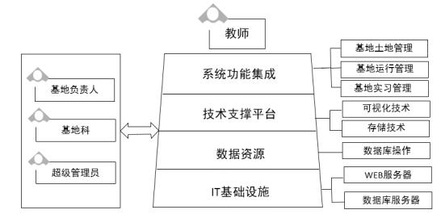

　　　　图2： 功能模块1 —— 基地土地管理
    
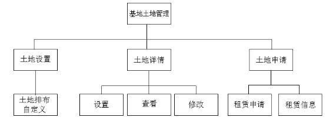

　　　　图3：功能模块2 —— 基地运行管理
    
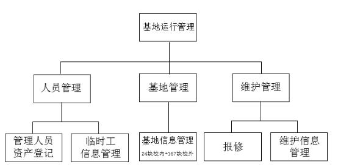

　　　　图4：功能模块3 —— 基地实习管理
    
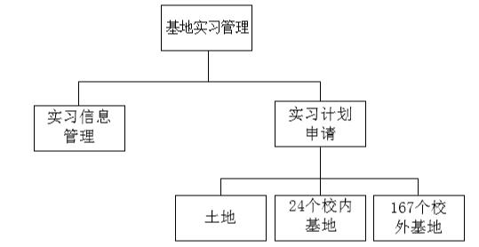
#### 2．功能描述
　　系统总体架构（见图1）分为四层，包括IT基础设施、数据资源、技术支撑平台、系统功能集成。IT基础设施层的要求并不高，主要是WEB服务器和数据库服务器，数据资源层以数据库操作为主，而技术支撑平台以可视化技术和存储技术为核心，其中我们主要做的，也是最重要的一层是系统功能集成层，它分为基地土地管理、基地运行管理、基地实习管理三个功能模块，系统由基地负责人、基地科和超级管理员全程参与，致力于为教师用户服务。
  　　第一个功能模块是基地土地管理（见图2），它又分为土地设置、土地详情、土地申请这三个子功能，而我们的一大亮点就是对土地排布自定义进行可视化的布局（见图2.1），其中每一块绿色部分就是一块田地，管理员可根据土地的实际情况，对绿色部分的面积和相对位置进行调整和设置，然后保存下来，这样的方式比起纯文本的设置显得更为友好。对于土地详情的基本操作（见图2.2）则是在已自定义好的田地上进行点击，管理员便可在弹出窗口中进行土地详情的设置，并保存，后期如想修改，在弹出窗口中点击修改按钮即可。而用户还有一个更为实时的详情查看方式（见图2.3），我们将会在每一块田地上竖一块贴有包含相应田地信息的二维码，用户可实地扫描，查看自己想要的信息。土地申请子功能（见图2.6），具有一个标准的流程，首先教师用户填写教学科研用地协议和土地有偿使用协议，然后提交土地申请给管理员，这时系统会从时间、用户和资源这三个维度进行冲突检测，再交由管理员审核，待审核成功，管理员将结果反馈给教师用户，教师用户就可在线下进行缴费，管理员再将缴费信息登记入库（见图2.4）。系统后期将会对土地租赁信息进行分析统计，反馈给管理员一张记录着每月租赁人数及增长率的折线图（见图2.5），以便管理员之后对租赁计划进行调整。
    　　第二个功能模块是基地运行管理（见图3），它分为人员管理、基地管理和维护管理三个子功能，人员管理按照人员类型又分为管理人员资产登记（见图3.1）和临时工信息管理（见图3.2），基地管理子功能则只包含24个校内基地和167个校外基地，系统同样会对其基地信息管理（见图3.3）进行数据的统计分析，生成学院基地面积（见图3.5）和基地承担实习学生人数（见图3.6）统计图，便于管理员对基地后期决策。还可点击查看详情，进一步查看所面向的专业和一次性可承担的学生人数（见图3.4）。维护管理功能则包含报修的流程和维护信息的管理，而报修的具体流程（见图3.9）则是基地负责人在线报修信息，等待维修完成，管理员在线登记维修信息，并进行保存，以便以后的查看和优化。维护信息的管理则填写在相应的维护信息网页表格上（见图3.7），系统会根据此表格统计分析出维护情况走势图（见图3.8），便于管理员的决策。
      　　 第三个功能模块是基地实习管理（见图4），它分为实习计划申请和实习计划管理两部分，在实习计划申请部分（见图4.3），教师可在土地基地、24个校内基地和167个校外基地中择其一，点击田地右上角的申请实习按钮（见图4.1）进行实习计划的填写和提交，系统进行冲突检测，再交由管理员审核，成功后将结果反馈给用户，那么整个实习计划的申请流程就完成了，而整个实习信息填写到实习信息管理的网页表格上（见图4.2）。
#### ３. 用户界面 
　　 图2.1：土地排布自定义网页原型
   
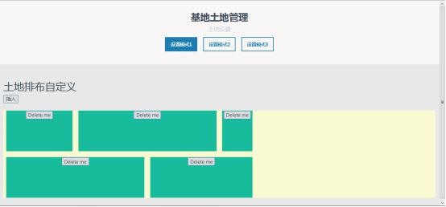

　　图2.2：土地详情填写界面（设置+查看+修改）
  
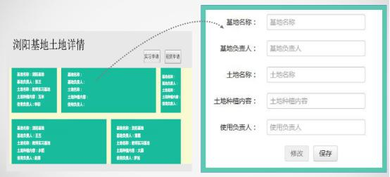

　　图2.3：土地详情查看——教师用户实地二维码扫描
  
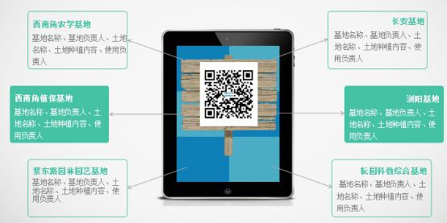

　　图2.4：土地租赁信息登记参考网页
  

　　图2.5：土地租赁信息趋势图
  
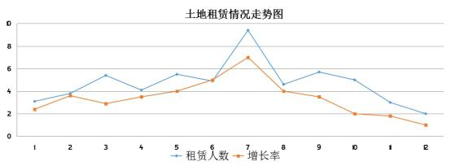

　　图3.1：管理人员资产登记界面

　　图3.2：临时工信息管理界面
  

  
　　图3.3：基地信息管理界面
  

　　图3.4：基地详情信息管理界面
  

　　图3.5：学院基地面积统计图
  
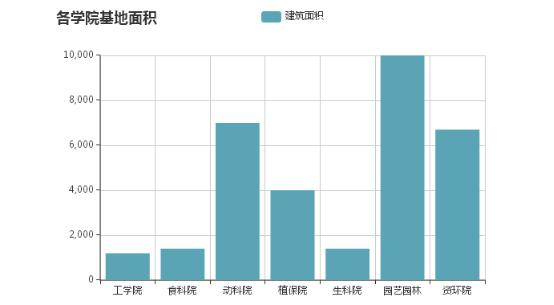

　　图3.6：基地承担实习学生人数统计图
  
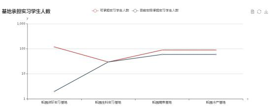

　　图3.7：维护信息填写界面
  

　　图3.8：维护情况走势图
  
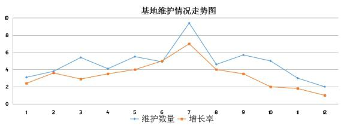

　　图4.1：用户实习申请界面
  
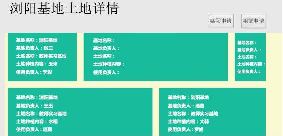

　　 图4.2：实习信息管理界面
   

### 五．业务流程
　　图2.6：土地租赁申请流程图
  
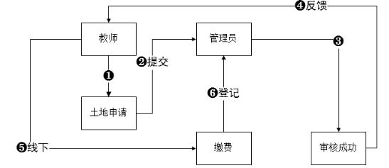

　　图3.9：报修流程图
  
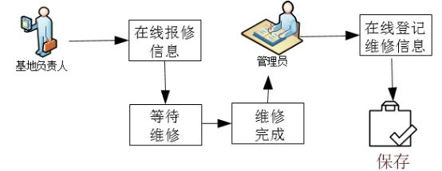

　　图4.3：实习计划申请流程图
  

 